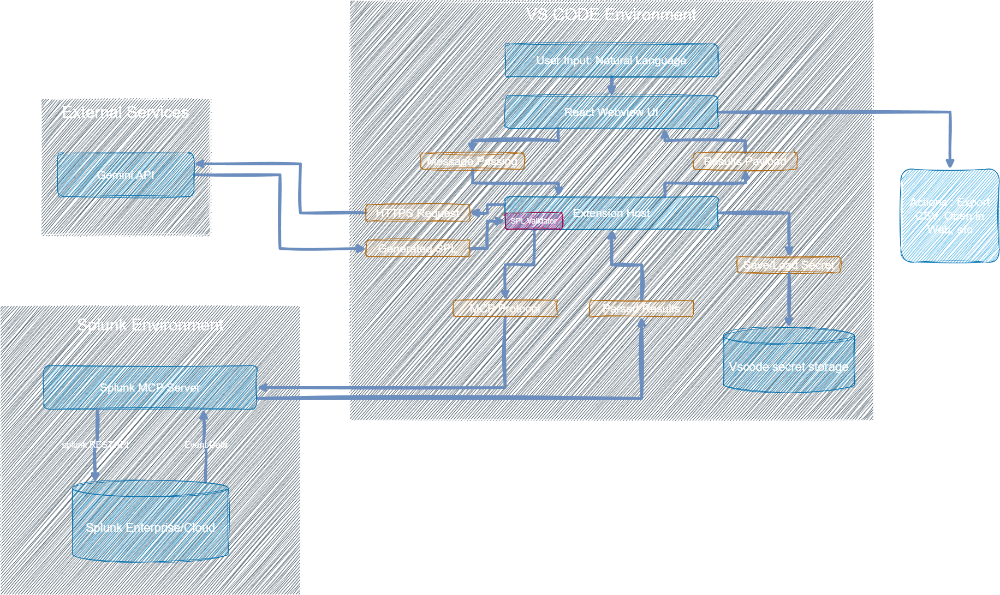

# **SplunkLens**

Query Splunk logs in plain English without leaving VS Code. SplunkLens brings the power of Splunk directly into your editor. Type a natural language question and get formatted log results instantly in a native VS Code panel.

Built for the Splunk Agentic Ops Hackathon 2026.

## The Problem

When a production issue occurs, developers face a disruptive workflow: stop coding, leave the editor, open a browser, log into Splunk, and try to remember SPL syntax. This context switching kills momentum and increases the time it takes to resolve incidents.

Junior developers who lack SPL expertise face an even steeper barrier. They cannot effectively query their own production logs without help.

## The Solution

SplunkLens is a VS Code extension that eliminates context switching entirely. A developer types a question in plain English such as "show me all failed logins in the last hour" and gets formatted, searchable log results directly inside VS Code. No browser. No SPL. No interruption.

The extension uses Gemini AI to translate natural language into valid SPL, and the Splunk MCP Server to execute queries securely against your Splunk instance with full RBAC enforcement. Log data never leaves your local environment.

## Architecture



All credentials are stored in VS Code SecretStorage, encrypted by the operating system. The Gemini API receives only the natural language question. Actual log data never leaves your machine.

## Prerequisites

Before installing SplunkLens, you need the following software and accounts set up.

### 1. Splunk Enterprise

Download and install Splunk Enterprise from https://www.splunk.com/en_us/download/splunk-enterprise.html

The free trial gives you 500 MB per day. Apply for a developer license at https://dev.splunk.com to increase this to 10 GB per day.

After installation, Splunk runs at http://localhost:8000 (web UI) and https://localhost:8089 (REST API).

### 2. Splunk MCP Server

The Splunk MCP Server is required for SplunkLens to query your Splunk instance.

Install it from Splunkbase: https://splunkbase.splunk.com/app/7931

After installation, configure it:

Go to Settings -> Roles -> admin -> Capabilities and enable the mcp_tool_execute capability. Save.

Then create a dedicated MCP token:

Go to Settings -> Tokens -> Enable Token Authentication if not already enabled. Then click New Token, set the audience to mcp, and copy the full token string that is generated. This token is used in the SplunkLens setup form.

### 3. MCP Proxy

The MCP Server requires a local proxy process to be running whenever you use SplunkLens.

Create a file called start-mcp.bat anywhere on your machine with this content:

```
@echo off
set NODE_TLS_REJECT_UNAUTHORIZED=0
npx -y mcp-remote https://localhost:8089/services/mcp --header "Authorization: Bearer YOUR_MCP_TOKEN_HERE"
```

Replace YOUR_MCP_TOKEN_HERE with the token you generated in the previous step.

You must run this batch file and keep it running in a terminal window every time you use SplunkLens. If you close the terminal, queries will fail.

### 4. Gemini API Key

SplunkLens uses Google Gemini to translate natural language into SPL. We hope to change that and make it available for all other LLMs in future versions.

Get a free API key from https://aistudio.google.com. The free tier supports 15 requests per minute, which is more than enough for daily use.

### 5. Node.js

Node.js version 18 or higher is required to build the extension from source. Download it from https://nodejs.org.

## Installation

### Option A: Install from VSIX (recommended)

Download the latest splunklens-x.x.x.vsix file from the GitHub releases page.

In VS Code, open the Extensions panel, click the three-dot menu at the top right, select Install from VSIX, and choose the downloaded file.

### Option B: Build from source

Clone the repository:

```
git clone https://github.com/BalramMardi/Splunklens
cd splunklens
```

Install dependencies:

```
npm install
cd webview
npm install
cd ..
```

Build the extension:

_For Windows_
```
npm run build
```

_For Mac/Linux_
```
npm run build:mac
```

Press F5 in VS Code to launch the Extension Development Host with SplunkLens running.

## Setup

Once SplunkLens is installed, follow these steps before your first query.

Step 1: Start the MCP proxy by double-clicking start-mcp.bat. Wait until you see "Proxy established successfully" in the terminal. Keep this window open.

Step 2: Open VS Code. Click the SplunkLens icon in the left activity bar. The setup form will appear.

Step 3: Fill in the four fields:

Splunk API URL is the REST API address of your Splunk instance. For a local installation this is https://localhost:8089.

Splunk Web URL is the frontend UI address for your instance. For a local installation this is http://localhost:8000.

Splunk MCP Token is the encrypted token you generated in the MCP Server setup step. It begins with eyJ.

Gemini API Key is the key from Google AI Studio.

Step 4: Click Save and Continue. A notification will confirm that credentials have been saved securely. The query panel will open.

## Usage

Type any natural language question into the input box and press Enter or click Search.

Example queries:

```
show me all failed login attempts in the last hour
```

```
count events by type today
```

```
show me all events in the botsv3 index from all time
```

```
show critical severity events in the last 6 hours
```

SplunkLens will translate your question into SPL, execute it against Splunk via the MCP Server, and display the results in a formatted table.

Canceling queries: If a search is taking too long or you notice a typo, the Search button dynamically changes to a Stop button. Clicking this instantly aborts both the Gemini API network request and the Splunk MCP execution.

### Results panel

Each result row shows the severity, timestamp, and message. Click any row to expand the full event JSON.

Click Show SPL to see the exact Splunk query that was generated and executed. This is useful for verifying results or learning SPL.

Click Open in Splunk to open the Splunk web UI with the generated query pre-filled for deeper investigation.

Click Export CSV to open a native save dialog and download all results directly to your local file system as a .csv file.

### Model selector

Next to the SplunkLens header, there is a dropdown menu that allows you to dynamically switch between Gemini models such as Gemini 2.5 Flash, Gemini 1.5 Flash, and Gemini 1.5 Pro. This is useful for testing speed versus reasoning capabilities on complex SPL translations.

### Query history

Your last five queries appear as clickable chips below the input box. Click any chip to re-run that query instantly.

### Logout

Click the Logout button at the top right of the panel to clear all stored credentials. The setup form will appear again so you can enter new credentials.

## How it works

When you submit a query, SplunkLens performs the following steps:

1. The query text is sent from the React webview to the extension host via VS Code's postMessage API. No credentials are accessible in the webview.

2. The extension host reads the Gemini API key from VS Code SecretStorage and sends the natural language query to the selected Gemini model over HTTPS. The system prompt instructs Gemini to return a strict JSON object containing the SPL query.

3. The generated SPL is validated against a blacklist of dangerous commands including delete, drop, outputlookup, sendemail, rest, and script. If any are found, the query is rejected before it reaches Splunk.

4. The extension host reads the Splunk URL and MCP token from SecretStorage and connects to the Splunk MCP Server via StreamableHTTPClientTransport with Bearer token authentication. It calls the splunk_run_query tool with the validated SPL. To prevent massive payloads from crashing the webview, the AI is instructed to append a strict head 50 limit to all open-ended queries.

5. Results are parsed and sent back to the webview as a structured payload containing the events array, the generated SPL, the result count, and the detected time range.

6. The webview renders the results in a formatted table that matches the user's current VS Code theme.

## Splunk AI capabilities used

This project leverages the following Splunk AI capabilities as required by the hackathon:

Splunk MCP Server is used for all query execution. The extension connects to the MCP Server at https://localhost:8089/services/mcp and calls splunk_run_query for searches. Authentication uses the MCP encrypted token with RBAC enforcement.

Splunk AI Assistant is installed alongside the MCP Server and provides the saia_ tool family. The architecture is designed to use saia_generate_spl for SPL generation once the Splunk AI Assistant cloud endpoint is available in the target deployment environment.

## Security

Credentials are stored in VS Code SecretStorage, which is encrypted by the operating system credential store. On Windows this is Windows Credential Manager. On macOS this is the system Keychain.

The Gemini API receives only the natural language query text. It never receives log data, Splunk credentials, or any other sensitive information.

Log data returned by Splunk is displayed locally in VS Code and is never transmitted to any external service.

The SPL validator prevents any destructive or sensitive commands from being executed even if Gemini generates them unexpectedly. 

## Project structure

```
splunklens
├─ architecture_diagram.png
├─ assets
│  ├─ architecture_diagram.png
│  ├─ logo.png
│  └─ monologo.png
├─ CHANGELOG.md
├─ esbuild.js
├─ eslint.config.mjs
├─ LICENSE
├─ package-lock.json
├─ package.json
├─ README.md
├─ src
│  ├─ extension.ts
│  └─ test
│     └─ extension.test.ts
├─ tsconfig.json
├─ vsc-extension-quickstart.md
└─ webview
   ├─ eslint.config.js
   ├─ index.html
   ├─ package-lock.json
   ├─ package.json
   ├─ public
   │  ├─ favicon.svg
   │  └─ icons.svg
   ├─ README.md
   ├─ src
   │  ├─ App.css
   │  ├─ App.tsx
   │  ├─ assets
   │  │  ├─ hero.png
   │  │  ├─ react.svg
   │  │  └─ vite.svg
   │  ├─ components
   │  │  ├─ QueryPanel.tsx
   │  │  └─ Setup.tsx
   │  ├─ index.css
   │  ├─ main.tsx
   │  ├─ types.ts
   │  ├─ vscode-mock.css
   │  └─ vscode.d.ts
   ├─ tsconfig.app.json
   ├─ tsconfig.json
   ├─ tsconfig.node.json
   └─ vite.config.ts

```

## Requirements

- VS Code 1.120.0 or higher
- Node.js 18 or higher
- Splunk Enterprise (free trial or developer license)
- Splunk MCP Server installed from Splunkbase
- Gemini API key from Google AI Studio

## Known limitations

The MCP proxy must be running in a separate terminal window while using SplunkLens. This is a limitation of the mcp-remote package and cannot be embedded inside the extension process.

Splunk's self-signed certificate on localhost requires NODE_TLS_REJECT_UNAUTHORIZED=0 when running the proxy. This is expected behavior for a local development instance and does not affect production deployments that use a valid SSL certificate.

The saia_generate_spl and saia_explain_spl tools from Splunk AI Assistant are installed and configured but currently return a 404 from the Splunk cloud endpoint. This is a server-side issue with the v2alpha1 API endpoint. SplunkLens falls back to Gemini for translation until this is resolved.

## License

MIT License. See [LICENSE](LICENSE) file for details.

